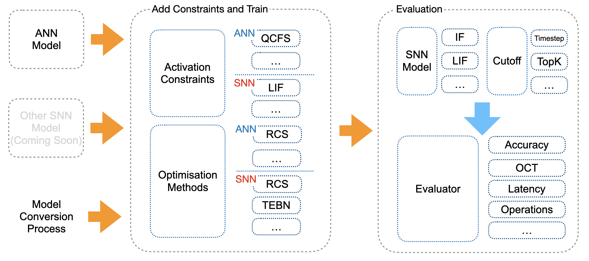

% SNNCutoff documentation master file, created by
% sphinx-quickstart on Sat Jan 13 20:04:38 2024.
% You can adapt this file completely to your liking, but it should at least
% contain the root `toctree` directive.

```{toctree}
:hidden:
tutorials/quick_start
references
```


<div align="center">
  <picture>
    <source media="(prefers-color-scheme: dark)" srcset="../docs/_static/dark_mode.png" width="700">
    
  </picture>
</div>

SNNCutoff is a Python package developed with a PyTorch backend, designed primarily for evaluating Spiking Neural Networks (SNNs).

# Overview

<p align="center">

</p>

- **SNN Training Algorithms**:
  - [**Notations and References**](references)


- **A New Metric**:
  - **Optimal Cutoff Timestep (OCT)**: A optimal timestep that determines the minimal input processing duration for maintaining predictive reliability in SNNs. OCT is grounded in theoretical analysis and serves as a robust benchmark for assessing SNN models under different optimization algorithms.

- **Cutoff Approximation**:
  - **Timestep (Baseline)**: Cutoff triggered using fixed timestep. 
  - **Top-K**: Cutoff triggered using the gap between the top-1 and top-2 output predictions at each timestep. 
  - **Others**: Coming soon. 
